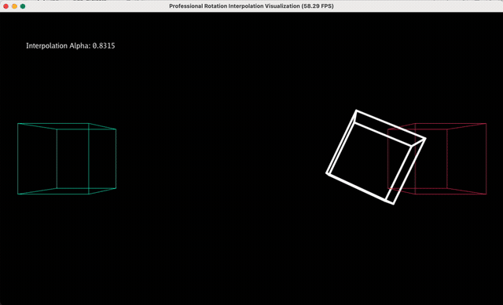

# 计算机图形学实验二：旋转与变换

本实验旨在通过Taichi Lang框架在Mac M3芯片（本人所用）上实现一个具有实时交互功能的**三角形平面旋转**以及**3D方体旋转渲染器**。实验涵盖了**坐标变换基本workflow**的核心理论与实践。ps.我在设计实验的过程中发现，所有的3D酷炫效果，本质上都是从2D平面的几何变换一步步推导出来的。

---

## 1. 项目环境与文件结构说明

本项目代码已托管至 GitHub，采用 Git 进行版本管理。

### 1.1 文件结构 (File Structure)
```text
Work1/
├── .gitignore              # 忽略 __pycache__ 等冗余文件
├── main_cube.py            # 完成选做任务：3D立方体渲染的main函数
├── main_triangle.py        # 完成基础任务：平面三角形旋转的main函数
├── interpolate_rotation.py # 完成进阶任务：3D立方体旋转插值的函数
├── rotate.py               # 涵盖绕z轴旋转等效果的变换矩阵计算函数
└── videos/                 # 实验演示效果图
    ├── cube_demo.gif       # 立方体demo
    └── triangle_demo.gif   # 三角形demo
```


---
## 2. 核心理论：从平面到空间的跨越

### 2.1基础：2D 平面的旋转理论
在2D平面中，如果我们想让一个点 $(x, y)$ 绕原点旋转 $\theta$ 角度，其实就是初中数学里的三角函数变换。
通过旋转矩阵 $R_{2d}$，我们可以得到变换后的坐标：

$$\begin{bmatrix} x' \\ y' \end{bmatrix} = \begin{bmatrix} \cos\theta & -\sin\theta \\ \sin\theta & \cos\theta \end{bmatrix} \begin{bmatrix} x \\ y \end{bmatrix}$$

在`main_triangle.py`中，我就是利用这个简单的逻辑让三角形在屏幕上“转”起来的。

### 2.2进阶：3D立方体的旋转与平移
到了3D空间，情况变得有趣了。一个立方体有8个顶点，我们要同时考虑$X, Y, Z$三个轴。

**我的理解：** 3D旋转其实就是一种“降维打击”。我们先让立方体绕着不同的轴旋转，然后再通过一个平移矩阵把它“提”到页面上方。

$$M = T(0, 1.2, 0) \cdot R_y(\theta) \cdot R_z(\theta)$$
* **旋转顺序很重要**：我实验发现，必须先旋转再平移。如果先平移，立方体就会像大摆锤一样绕着原点甩，而不是在原地自转。

### 2.3 终点：透视投影（为什么能看到远近？）
为了让立方体看起来“真实”，我们需要模拟人眼的“近大远小”。这就用到了透视投影矩阵$P$。
它最核心的作用是处理 $Z$轴（深度）。变换公式如下：

$$V_{clip} = P \cdot V \cdot M \cdot V_{local}$$

最后通过**透视除法**（除以 $w$ 分量），原本 3D 的坐标就变成我们屏幕上看到的2D点了。

---

## 3.进阶探索：旋转插值可视化

这是本次实验的最具挑战性的部分：如何让一个立方体平滑地从“左侧起始姿态”变换到“右侧结束姿态”？

### 3.1姿态向量插值 
我们定义起始姿态角度为 $\vec{P}_{start}$，目标姿态为 $\vec{P}_{end}$。引入时间系数 $t \in [0, 1]$，当前帧的姿态 $\vec{P}_{curr}$ 为：
$$\vec{P}_{curr}(t) = (1 - t) \cdot \vec{P}_{start} + t \cdot \vec{P}_{end}$$

### 3.2 运动平滑化
为了让动画更专业，我没有使用死板的线性时间，而是利用正弦函数模拟了**Ease-in-Out**效果，使方块在两端有轻微的减速停顿感：


$$t = \frac{\sin(\text{timer} - \pi/2) + 1}{2}$$

### 3.3 视觉构图与纠偏
为了清晰展示过程，我设计了三色对比系统：
* **青绿色**：固定在左侧的起始姿态。
* **玫瑰**：固定在右侧的结束姿态（多轴大幅度复合旋转）。
* **纯白色**：加粗渲染的动态方块，在两者之间进行 $720^\circ$ 的翻滚穿梭。
同时，我引入了**宽高比**校正，解决了 3D 空间在 1200x700 窗口下的拉伸畸变问题。

---

## 4. 关键代码实现

在 `interpolate_rotation.py` 中，GPU 内核同时驱动三组顶点的变换，性能极佳：

```python
@ti.kernel
def render_frame(mvp_i: ti.types.matrix(4, 4, ti.f32), 
                 mvp_s: ti.types.matrix(4, 4, ti.f32), 
                 mvp_e: ti.types.matrix(4, 4, ti.f32)):
    for i in range(8):
        v = ti.Vector([v_pos_3d[i].x, v_pos_3d[i].y, v_pos_3d[i].z, 1.0])
        # 同时并行计算插值、起始、结束三组坐标
        # 执行矩阵乘法与透视除法...
```
---
## 5. 实验结果展示(Demos)
为了更直观地展示变换效果，我录制了三个 Demo：

|【2D基础：三角形旋转测试】 |【3D立方体：旋转与整体平移】|【3D立方体旋转插值路径可视化】|
| :---: | :---: |:---: |
|  |  | |

> **初学者笔记**：左图展示了纯粹的坐标轴旋转；中图则加入了 $Z$ 轴深度感和 $Y$ 轴方向的平移（可以看到立方体始终保持在视野上方自转）；在最后的插值 Demo 中，可以看到白色方块精准地从左侧青色框出发，经过大幅度翻滚后，完美契合进右侧的红色框中。


## 6. 个人思考与避坑指南😭😭😭
**坐标系的陷阱**：刚开始我的立方体是倒着的，后来发现是因为屏幕坐标系的(0,0)在左下角，而NDC空间的中心在中间。

**比例畸变**：最初方块看起来像个长方形，后来意识到必须在投影矩阵中考虑Window_Width / Window_Height的比例。

**性能优越**：在M3芯片上用ti.metal后端，即使同时渲染三个大幅度旋转的立方体也完全不掉帧，GPU并行计算效果确实很好

**Git 的折腾记录**：虽然处理SSH密钥很痛苦，但现在能熟练地使用git push同步我的图形学进展，成就感爆棚。

【Author: wrh-human】
【Date: 26th March 2026】
